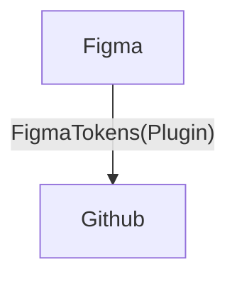

# 開発デザイン連携Demo

## 目的

・CSS命名規則の統一
・UI確認箇所の統一
・デザイナーとエンジニア間の連携の容易化


## 使用Tool&Package
・[Figma](https://www.figma.com/files/team/1061106007959766714/recents-and-sharing?fuid=1061106002521003021)



・[StyleDictionary](https://amzn.github.io/style-dictionary/#/)
```bash
# FigmaTokensによって生成されたtokens.jsonからSCSSを作成
npx style-dictionary build
```

・[StoryBook](https://storybook.js.org/)
```bash
# Local環境でStoryBookを起動
npm run storybook
```
